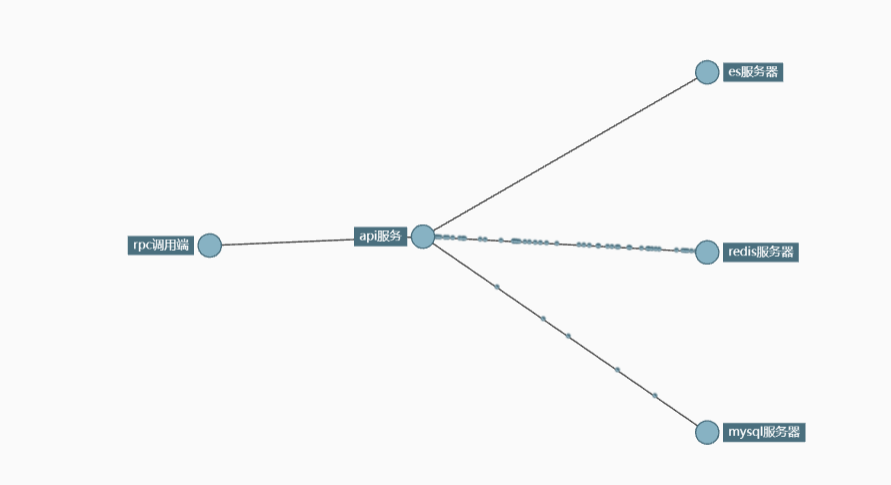
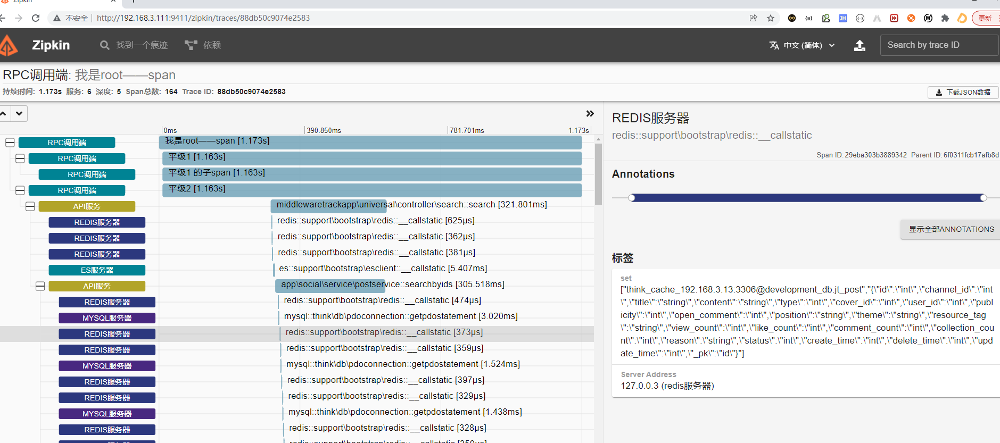

### webmanTracer使用教程

> webman的链路追踪组件，基于xiaoyangguang/webman_aop， 实现了基本的链路追踪组件，
> 比如mysql es redis 开发者可自定义追踪方法函数，实现自己需要追踪的组件，实现自定义追踪
> ，也可追踪composer加载的库，比如thinkorm的数据库执行函数

#### 安装

```
composer require xiaoyangguang/webman_tracer
```

> 配置 middleware.php.php文件

```php
<?php
return [
    xioayangguang\webman_tracer\middleware\Tracer::class 
     //....省略其他 
];
```

> 我们需要在 config 目录下，增加 tracer.php 配置

```php
<?php
//区分大小写
use app\social\service\PostService;
use support\bootstrap\EsClient;
use think\db\PDOConnection;
use xioayangguang\webman_tracer\example\ElasticsearchAspect;
use xioayangguang\webman_tracer\example\GenericAspect;
use xioayangguang\webman_tracer\example\MysqlAspect;
use xioayangguang\webman_tracer\example\RedisAspect;

return [
    'is_enable' => true,  // 是否开启 可空默认false
    'rate' => 0.99,  // 抽样率 0到1之间 可空默认为1
    'report_time' => 10,  //每10秒上报一次  可空默认10秒
    'service_name' => 'API_SERVICE', //当前节点名称可空
    'ipv4' => '', // ip 地址可空
    'port' => '8787', //端口可空
    'endpoint_url' => 'http://127.0.0.1:9411/api/v2/spans', //上报地址
    'tracer' => [
        RedisAspect::class => [ //追踪数据处理类
            support\bootstrap\Redis::class => [  //被追踪类
                '__callStatic', //被追踪方法
            ],
        ],
        ElasticsearchAspect::class => [//追踪数据处理类
            EsClient::class => [
                '__callStatic',//被追踪方法
                '__call',//被追踪方法
            ],
        ],
        MysqlAspect::class => [//追踪数据处理类
            PDOConnection::class => [  //追踪底层数据库执行方法例子
                'getPDOStatement',//被追踪方法
            ],
        ],
        GenericAspect::class => [ //追踪数据处理类 通用追踪节点 任由开发者发挥
            PostService::class => [
                'searchByIds',
            ],
        ],
    ]
];
```

> 自定义收集追踪上报数据类,并配置在tracer.php 中(可选，如果example无法满足你的需求)

```php
<?php
/**
 * Created by PhpStorm.
 * User: zhangxiaoxiao
 */

namespace xioayangguang\webman_tracer\aspect;

use xioayangguang\webman_aop\AspectInterface;
use xioayangguang\webman_tracer\SpanManage;
use Zipkin\Span;

//依赖切面 必须实现AspectInterface接口
class GenericAspect implements AspectInterface
{
    /**
     * 添加调用参数到追踪组件
     * @param $params
     * @param $class
     * @param $method
     */
    public static function beforeAdvice($params, $class, $method): void
    {
        //SpanManage自动维护调用栈 parentspan
        SpanManage::startNextSpan($class . '::' . $method, function (Span $child_Span) use ($params) {
            foreach ($params as $key => $value) {
                $child_Span->tag("params_{$key}", json_encode($value));
            }
        });
    }

    /**
     * 函数执行完成后收集数据到追踪组件中
     * @param $res
     * @param $params
     * @param $class
     * @param $method
     */
    public static function afterAdvice(&$res, $params, $class, $method): void
    {
       //SpanManage自动维护调用栈 parentspan  有startNextSpan 必须有stopNextSpan 
        SpanManage::stopNextSpan(function (Span $child_Span) use ($params, $res) {
            $child_Span->tag('method_return', json_encode($res));
        });
    }

    /**
     * 处理上面异常情况，或者业务异常情况，清理数据并上报
     * @param $throwable
     * @param $params
     * @param $class
     * @param $method
     */
    public static function exceptionHandler($throwable, $params, $class, $method): void
    {
        SpanManage::stopNextSpan(function (Span $child_Span) use ($throwable) {
            $child_Span->tag('exception.message', $throwable->getMessage());
            $child_Span->tag('exception.code', $throwable->getCode());
            $child_Span->tag('exception.stacktrace', $throwable->getTraceAsString());
        });
    }
}
```

> 最后启动服务，并测试。

```shell
docker run -d --restart always -p 9411:9411 --name zipkin openzipkin/zipkin 

php start.php start
curl  http://127.0.0.1:8787

在浏览器访问：http://ip:9411/zipkin/查看平台数据
```





